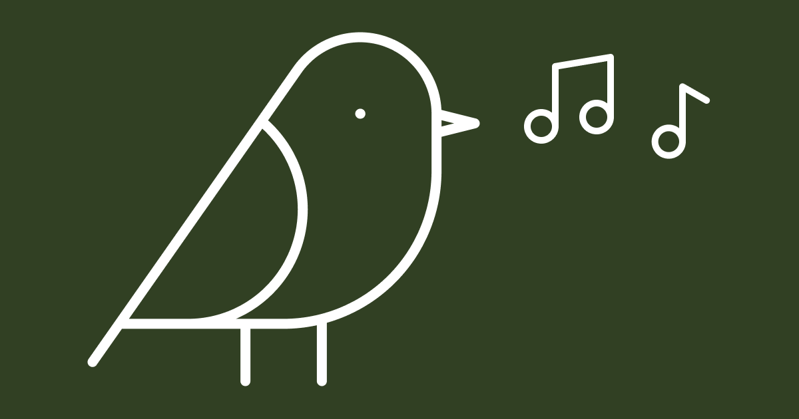

# BirdTunes

This is an experimental project to discover and track the birds in our garden. It uses a Raspberry Pi to listen and AI-powered bird sound recognition from [BirdNet Sound ID](https://birdnet.cornell.edu/).

## Demo

https://birdtunes.net

## Current setup

A Raspberry Pi 5 and an outdoors microphone to listen to the enviroment, and AI-powered bird sound recognition from [BirdNet Sound ID](https://birdnet.cornell.edu/). The data is handled by [BirdNET-Go](https://github.com/tphakala/birdnet-go) and uploaded to [Birdweather](https://app.birdweather.com/) for additional verification.

This repo / website pulls together all the data and presents it in a nice and orderly fashion.

## Development

Made with Next. Install dependencies with `npm install` and run `npm run dev`.

## Comments

Feel free to add suggestions, pull requests or fork this repo and customize it to your own needs.
